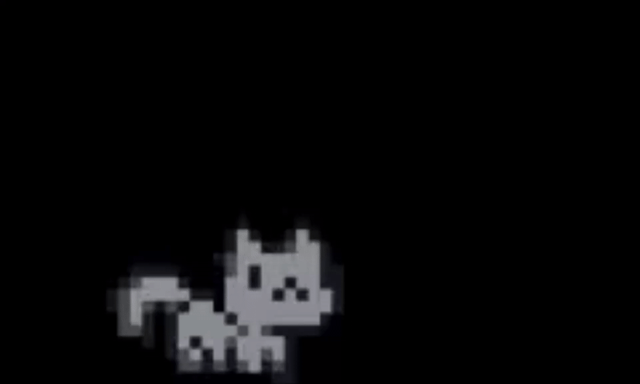

## nurikjohn

### A bit about me

Hey! I’m Nurik (short for **Nuriddin** — pronounced *Noo-reed-deen*), and welcome to my GitHub page 👋  
I’m all about learning in public, building cool things (sometimes weird things), and leveling up one commit at a time. Whether it’s web development, open source tools, or just exploring tech for fun — I’m here for it.

Also, I love cats 😺. Just putting that out there.

### What I'm hacking on

One project I’m especially excited about is [tandir.app](http://tandir.app) ⚡ — a gamified platform to help people learn programming languages in Uzbek. It’s designed around friendly battle-style matches to make learning more engaging and accessible. More than just a project — it’s a mission to make coding education more fun and local-language friendly.

Check out my pinned repos to see what else I’ve been up to lately!

### Nerd corner

**keyboards**: zsa voyager (split gang ✌️)  
**editor**: neovim btw  
**stack**: javascript/typescript, node, tailwind, some python and go when I’m feeling spicy.

### The vibe

write code, drink tea (or coffee), tweak dotfiles, repeat.  
enjoy the process, build in public, and stay **curious** ☕💻🌌
